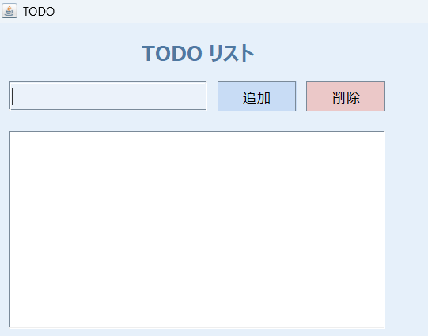
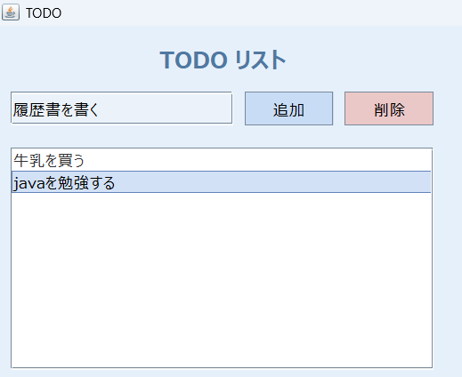
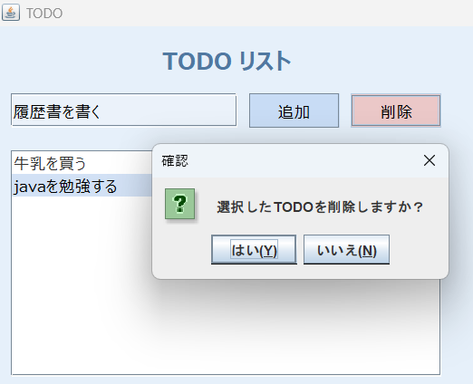

# TODO管理アプリ

## 概要
Javaの学習を目的として作成した、デスクトップ用のTODO管理アプリです。  
Swingを使用し、画面操作に応じてTODOの追加・削除ができるように実装しました。

## アプリ画面

### 起動画面

  

### TODO追加
テキストフィールドに内容を入力し、追加ボタンまたはEnterキーを押すことで  
TODO一覧にデータが追加されます。

  

### TODO削除
一覧から選択したTODOを削除ボタンで削除できます。

  

## 制作目的
・Javaの基本的な文法に慣れるため  
・クラス・メソッド・イベント処理の理解を深めるため  
・GUIアプリケーションの仕組みを学ぶため  

## 使用技術
・Java  
・Swing  

## 機能
・TODOの追加  
・TODOの一覧表示  
・TODOの削除  

## 工夫した点
・処理ごとにクラスやメソッドを分け、可読性を意識しました  
・ボタン操作だけでなく、Enterキーでも追加できるようにして操作性を向上させました  

## 難しかった点
・ボタンを押したときに処理が実行されるよう、イベントリスナーの仕組みを理解する点が難しかったです  

## 今後やりたいこと
・TODOをファイルに保存し、アプリ再起動後も保持できるようにしたいです  
・編集機能や完了状態の管理も追加したいです  
